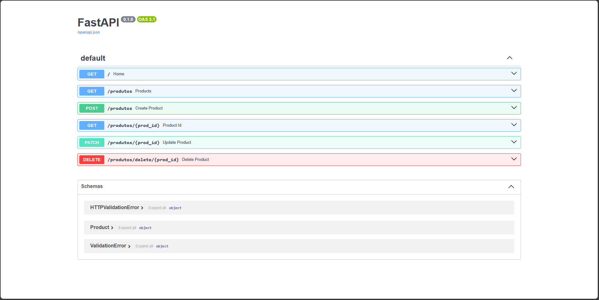

## Desenvolvimento de APIs e Microserviços com FastAPI em Python.

### Requisitos
- Python 3.10
- FastAPI
- Uvicorn
- Pydantic
- SQLModel
- Typing


### FastAPI - Framework Web
- [Documentação](https://fastapi.tiangolo.com/)

### SQLModel - ORM
- [Documentação](https://sqlmodel.tiangolo.com/)

### Instalação
```bash
pip install -r requirements.txt
# Recomendado o uso de um ambiente virtual
```

### Execução
```bash
uvicorn main:app --reload
```

### Documentação
A documentação da API pode ser acessada na rota `/docs` ou `/redoc` após a execução do servidor.

